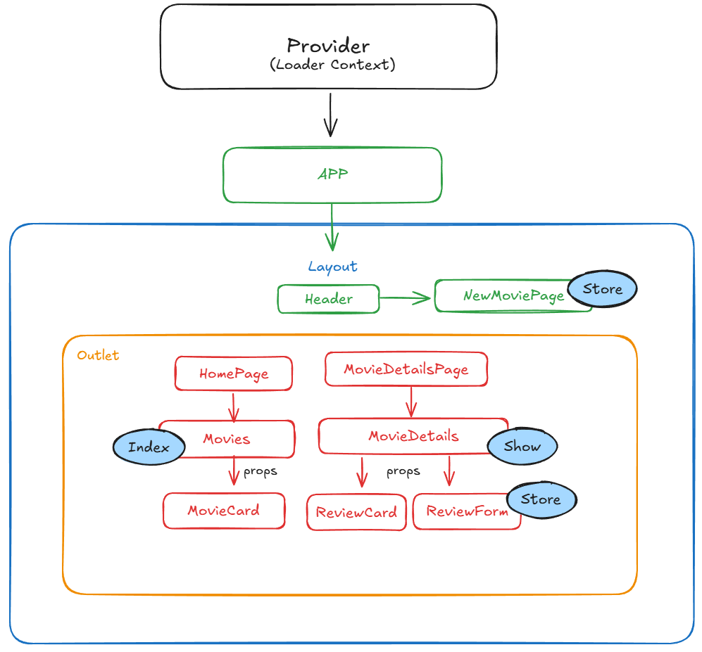
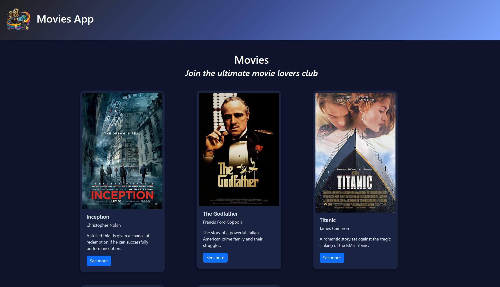
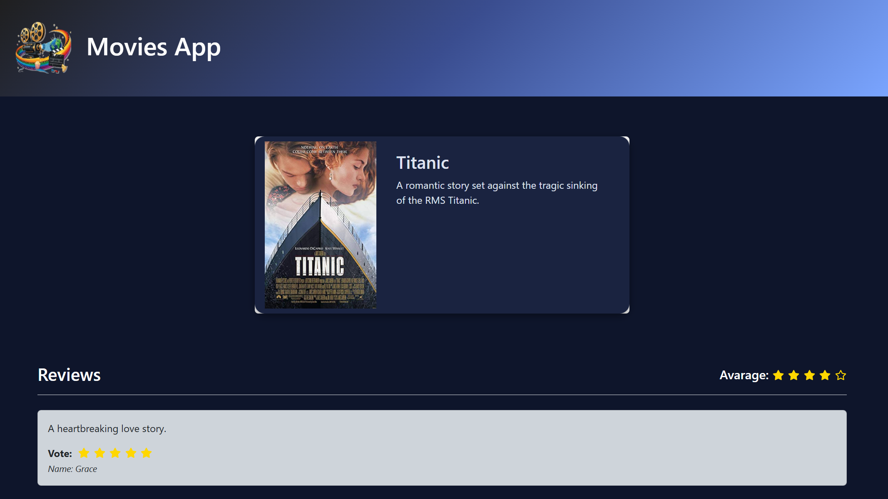
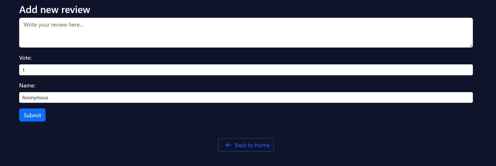

<h1 align="center"> Web App React </h1>
<h4 align="center">Ora è il momento di prepararci al frontend della nostra Web App!</h4>

## Consegna - I PARTE

MILESTONE 0 
- Ragionare e preparare uno schemino per impostare la struttura del lavoro in maniera da sfruttare la riutailizzabilità dei componenti React e le loro props.,

MILESTONE 1
- Mettiamo su un nuovo progetto React aiutandoci con Vite,
- Ripuliamo come sempre l’app da file e codice di esempio non necessari,
- Installiamo il necessario: React Router, Axios e Bootstrap (se volete utilizzarlo),

MILESTONE 2
- Creiamo un layout di base per la nostra applicazione ed impostiamo le rotte per le diverse pagine.,
- Creiamo 2 pagine:
- La home, in cui mostreremo la lista dei film
- La pagina di dettaglio di un singolo film,

MILESTONE 3
- Configuriamo l’app di backend (repo webapp-express) a ricevere chiamate dalla nostra applicazione React, installando e impostando il middleware CORS.
- Proviamo quindi ad effettuare una chiamata Ajax dalla home del progetto React, per ottenere la lista dei film

MILESTONE 4
- In ultimo, effettuiamo una chiamata AJAX dalla pagina di dettaglio per ottenere il dettaglio di un singolo film, comprese le sue recensioni

## Bonus
Curare l’aspetto estetico dell'applicazione.
Se il resto è a dir poco perfetto e tutto compreso potrei aggiungere magari qualche features (es. 404 e media voti)
 
 
 

## Consegna - II PARTE
Miglioriamo l’esperienza dell’utente inserendo 

MILESTONE 1 (BACKEND)
- Predisponiamo un’API per salvare nel database una nuova recensione legata ad un film
- Testiamola su postman e verifichiamo che nel DB venga effettivamente inserita una nuova recensione

MILESTONE 2 (FRONTEND)
- Creiamo un componente che contenga il form per le recensioni
- Inseriamo questo componente nella pagina di dettaglio del film
- All’invio del form, la nuova recensione viene salvata sul database e visualizzata nella pagina, in fondo alle altre

## BONUS:
Come sempre curiamo il layout e il CSS
 
 
 

## Anteprima Schema Web App React

## Anteprima HomePage

 
 
 

## Anteprima Pagina del dettaglio (MovieDetailsPage)

 
 
 

##  Anteprima Pagina NotFound (404)

 
 
 

## Tecnologie utilizzate

- React + Vite
- React Router DOM
- Axios
 
 
 